  

## Welcome to my profile!

I'm a developer, one that started learning basic programming stuff, took a break and right after is developing Android stuff.

Just call me by Clover. my pronouns are he/him/they/them.

I'm the main developer of the [StarlightKernel project](https://github.com/StarlightKernel), and i was the one who started it. 

My Github Stats:

Check out:

<!--
**iamCloverDT/iamCloverDT** is a ✨ _special_ ✨ repository because its `README.md` (this file) appears on your GitHub profile.

Here are some ideas to get you started:

- 🔭 I’m currently working on ...
- 🌱 I’m currently learning ...
- 👯 I’m looking to collaborate on ...
- 🤔 I’m looking for help with ...
- 💬 Ask me about ...
- 📫 How to reach me: ...
- 😄 Pronouns: ...
- ⚡ Fun fact: ...
-->
